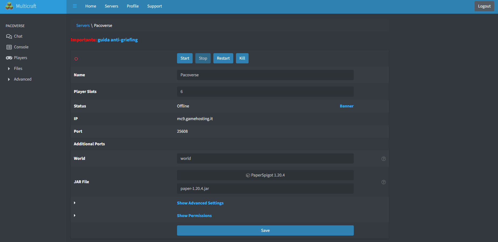

# Regolamento generale
Questo è un server ***multiworld***, il che significa che esistono più mondi su cui giocare, tutti con regole diverse. Per consultare il regolamento di ciascun mondo, basta andare in-game e leggere direttamente lì. Per entrare è necessario un procedimento particolare:
- Bisogna aggiungere il proprio nome alla **whitelist**, o attraverso la console (disponibile solo previo pagamento del server) o attraverso una comunicazione scritta a un admin che provvederà ad aggiungervi. Se avete accesso alla console, potrete eseguire il comando ***whitelist add <nickname>*** per aggiungervi.
- Bisogna darsi i permessi per giocare, o attraverso la console (disponibile solo previo pagamento del server) o attraverso una comunicazione scritta a un admin che provvederà a darveli. Se avete accesso alla console, potrete eseguire il comando ***pex user <nickname> group add Confirmed*** per darvi i permessi. Scrivendo in chat, dovreste avere un'etichetta "*[User]*" di fianco al vostro nome.

# Console e Amministrazione
Esistono utenti premium, che in-game possiedono un simbolo del ***$*** dopo il proprio nickname. Questi utenti hanno contribuito pagando al server e perciò possono usare la console a loro piacimento. La console ti dà accesso al pannello di controllo del server, ai files di configurazione e al comando **/op**. Tuttavia, si devono usare questi comandi solo ed esclusivamente se ***SI SA QUELLO CHE SI FA***. La console, infatti, come vantaggio principale ha l'avvio/lo stop del server a piacimento. Per utilizzare la console ti basta accedere a [questo link](https://minecraft.gamehosting.it/panel/index.php?r=site/login) e digitare il nickname e la password. Tutte le informazioni come nickname, passwords e IP per l'accesso li trovi **SOLO SU DISCORD** nel canale `#server-minecraft`. Una volta dentro, ti si aprirà una schermata come questa:

Basterà cliccare su "**Start**" per avviare il server.

***IMPORTANTISSIMO***: onde evitare griefers, ogni volta che si finisce di giocare il server va spento! Premere quindi il tasto "**Stop**".
